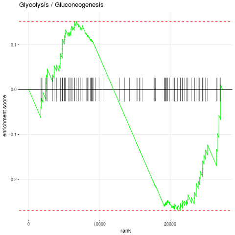
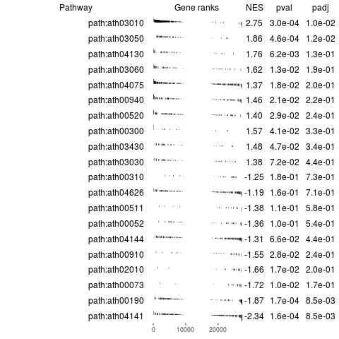

    
```{css}
pre code {
    white-space: pre !important;
    overflow-x: scroll !important;
    word-break: keep-all !important;
    word-wrap: initial !important;
}
```

```{r style, echo = FALSE, results = 'asis'}
BiocStyle::markdown()
options(width=100, max.print=1000)
knitr::opts_chunk$set(
    eval=as.logical(Sys.getenv("KNITR_EVAL", "TRUE")),
    cache=as.logical(Sys.getenv("KNITR_CACHE", "TRUE")))
```

```{r setup, echo=TRUE, messages=FALSE, warnings=FALSE}
    library(systemPipeR)
    library(KEGGREST)
    library(fgsea)
    library(ggplot2)
```

Fast gene set enrichment analysis (`FGSEA`) method which is much faster than the original method in finding nominal p-values. The method is based on an algorithm to calculate cumulative gene set enrichment statistic values, which allows to rapidly calculate multiple sample statistic values from a single sample. Ability to get accurate nominal p-values achieved by the
method in a reasonable time leads to using well-developed general methods for multiple testing correction such as Bonferroni or Benjamini-Hochberg. See more information [here](http://biorxiv.org/content/early/2016/06/20/060012).

The required inputs are a pathway list with the names and corresponding genes and the ranked genes. 
```{r pathways, eval=TRUE}
listDatabases()
org <- keggList("organism")
head(org)

path <- keggLink("ath", "pathway")
names <- unique(names(path))

path <- sapply(names, function(name) {unlist(path[grep(name, names(path))])})

for (i in 1:length(path))  {names(path[[i]]) <- NULL}

for (i in 1:length(path)) { path[[i]] <- gsub("ath:", "", path[[i]]) }
head(path)
```

```{r rank set, eval=TRUE, message=FALSE}
edgeDF <- read.table(file = "edgeDF.xls", sep = ""); edgeDF[is.na(edgeDF)]<-0
genes <- as.vector(edgeDF[,1])
names(genes) <- rownames(edgeDF)
```

Running fgsea:
```{r}
fgseaRes <- fgsea(pathways = path, stats = genes, minSize=15, maxSize=500,nperm=10000)
#The resulting table contains enrichment scores and p-values
head(fgseaRes[order(pval), ])
#It takes about ten seconds to get results with significant hits after FDR correction:
sum(fgseaRes[, padj < 0.01])
```


One can make an enrichment plot for a pathway:
```{r plot, echo=FALSE, message=FALSE}
pdf("./plotEnrichment.pdf")

plotEnrichment(path[["path:ath00010"]],genes) + labs(title="Glycolysis / Gluconeogenesis")
 
dev.off()
```
                                    
<div align="center">Figure 1: Pathway enrichment</div></br> 


Or make a table plot for a bunch of selected pathways:
```{r code, message=FALSE}
topPathwaysUp <- fgseaRes[ES > 0][head(order(pval), n=10), pathway]
topPathwaysDown <- fgseaRes[ES < 0][head(order(pval), n=10), pathway]
topPathways <- c(topPathwaysUp, rev(topPathwaysDown))
```

```{r plot2, echo=FALSE, message=FALSE} 
pdf("./topPathways.pdf")

plotGseaTable(path[topPathways], genes, fgseaRes,  gseaParam = 0.5)                                                              
dev.off()
```

  
<div align="center">Figure 2: Pathway enrichment</div></br> 


